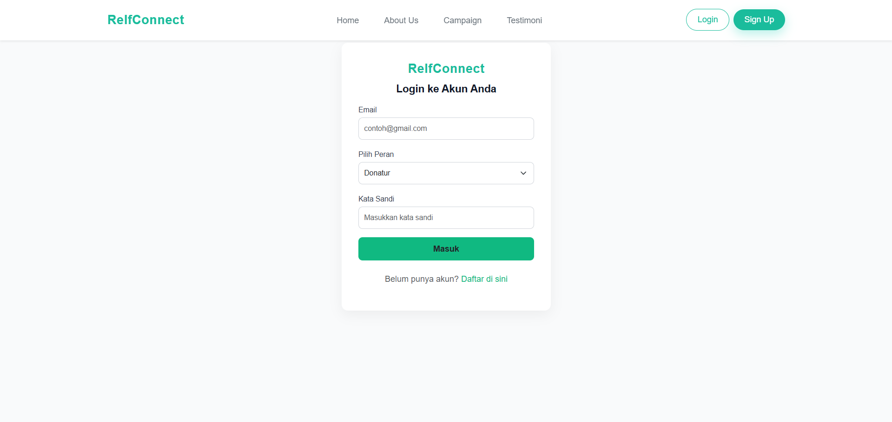
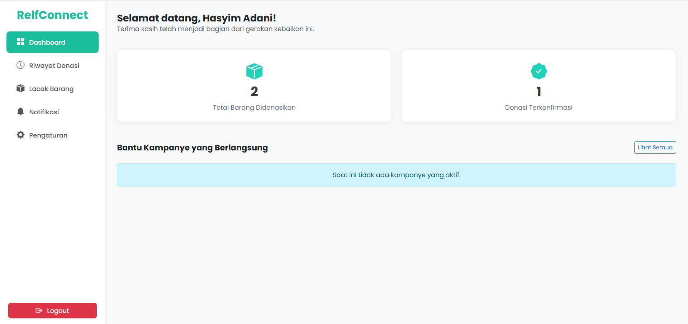
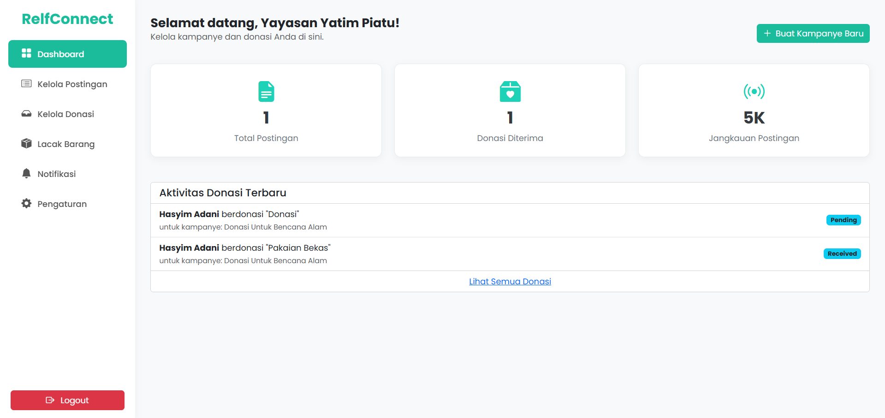
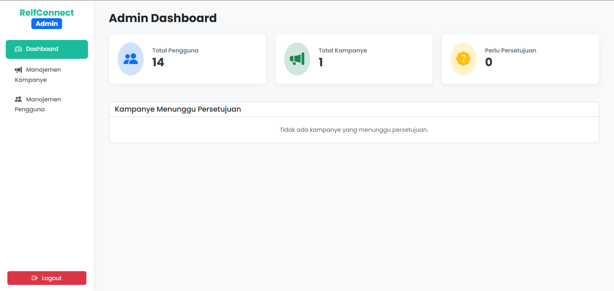
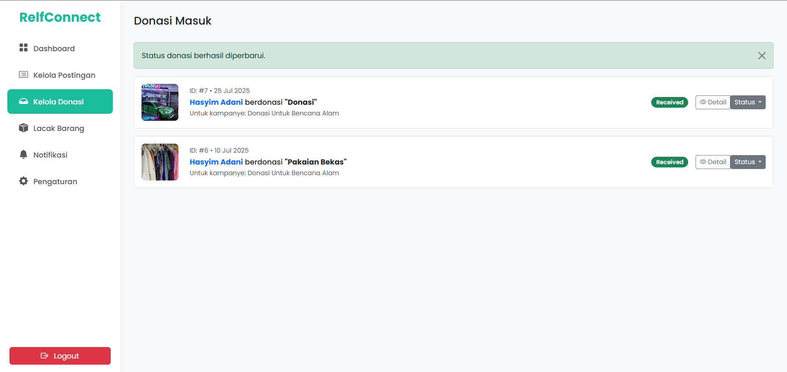
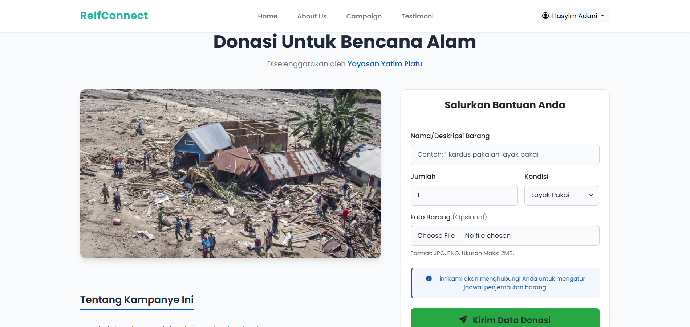
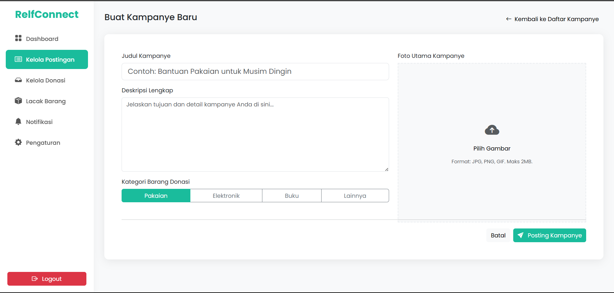
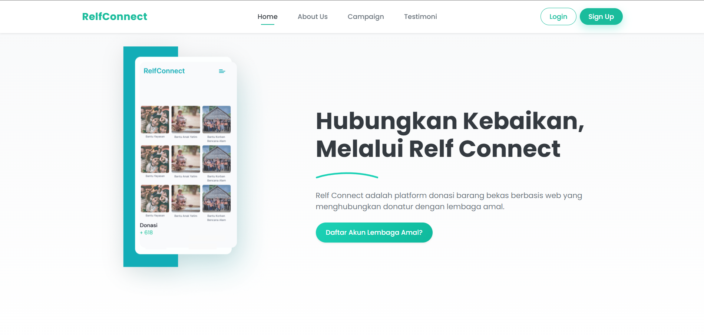

# RelfConnect - Platform Donasi Barang Bekas

RelfConnect adalah sebuah platform donasi yang menghubungkan **Donatur**, **Lembaga Amal**, dan **Admin** dalam satu aplikasi berbasis web. Aplikasi ini dikembangkan dengan metode **Prototyping** menggunakan framework **CodeIgniter 3**, yang memungkinkan pengembangan iteratif berdasarkan masukan pengguna secara langsung.

## 🔧 Teknologi yang Digunakan

- CodeIgniter 3 (PHP Framework)
- MySQL (Database)
- HTML/CSS & Bootstrap (Frontend)
- jQuery (Interaktivitas)
- XAMPP/Apache (Localhost Development)

---

## 📌 Fitur Utama

### 👤 Donatur
- Melihat daftar dan detail kampanye donasi.
- Mengisi formulir donasi barang.
- Melacak status donasi dan melihat riwayat donasi.

### 🏢 Lembaga Amal
- Mendaftar dan diverifikasi oleh Admin.
- Membuat, mengedit, dan menghapus kampanye.
- Mengelola barang donasi yang masuk dan update status pengiriman.

### 🛠️ Admin
- Verifikasi akun lembaga.
- Menyetujui atau menolak kampanye donasi.
- Memantau statistik pengguna dan aktivitas platform.

---

## 🖥️ Screenshot Tampilan

| Halaman | Tampilan |
|--------|----------|
| Login Page |  |
| Dashboard Donatur |  |
| Dashboard Lembaga |  |
| Dashboard Admin |  |
| Kelola Donasi |  |
| Detail Kampanye |  |
| Daftar Kampanye |  |
| Homepage |  |

---

## ⚙️ Struktur Class (Controller & Model)

| Tipe | Nama Class | Lokasi | Deskripsi |
|------|------------|--------|-----------|
| Controller | Auth | `controllers/Auth.php` | Autentikasi login & register |
| Controller | Home | `controllers/Home.php` | Halaman utama publik |
| Controller | Campaigns | `controllers/Campaigns.php` | Daftar dan detail kampanye |
| Controller | Dashboard (Donatur) | `controllers/donatur/Dashboard.php` | Statistik & pelacakan donasi |
| Controller | Donasi | `controllers/donatur/Donasi.php` | Formulir donasi barang |
| Controller | Dashboard (Lembaga) | `controllers/lembaga/Dashboard.php` | CRUD kampanye |
| Controller | Donations | `controllers/lembaga/Donations.php` | Kelola donasi masuk |
| Controller | Dashboard (Admin) | `controllers/admin/Dashboard.php` | Statistik, verifikasi, validasi |
| Model | User_model | `models/User_model.php` | CRUD user |
| Model | Campaign_model | `models/Campaign_model.php` | CRUD kampanye |
| Model | Donation_model | `models/Donation_model.php` | CRUD donasi |

---

## 📈 Metodologi: Prototyping

### Tahapan Pengembangan
1. **Pengumpulan Kebutuhan**  
   Identifikasi kebutuhan dari tiga jenis pengguna: Donatur, Lembaga, dan Admin.

2. **Desain Cepat (Quick Design)**  
   Pembuatan desain UI awal dan alur kerja utama setiap peran.

3. **Membangun Prototipe**  
   Implementasi awal menggunakan CodeIgniter 3 dengan fitur dasar.

4. **Evaluasi & Perbaikan Prototipe**  
   Siklus evaluasi dan revisi dilakukan berdasarkan error & feedback (ex: error 404, tema UI).

5. **Implementasi Final**  
   Versi akhir disusun setelah penyempurnaan iteratif dan pengujian awal berhasil.

---

## ✅ Kebutuhan Pengguna & Solusi

| Peran | Masalah | Solusi |
|-------|---------|--------|
| Donatur | Ingin tahu status donasi | Fitur Riwayat & Lacak |
| Lembaga | Ingin mengelola kampanye | Dasbor kampanye & status donasi |
| Admin | Ingin memverifikasi pengguna & kampanye | Dashboard Admin untuk manajemen |

---

## 🔗 Link Proyek

- 💻 Source Code GitHub: [**([REPOSITORY](https://github.com/halvest/prototype-manajemen-proyek))**](#main)
- 🌐 Demo: [Localhost](http://localhost/manajemen-proyek/)
- 🌐 Demo: [Youtube](https://youtu.be/NPL0xQLCdG0)

---

## 📬 Kontak

Untuk pertanyaan, silakan hubungi via Issues di GitHub atau email pribadi.

---

